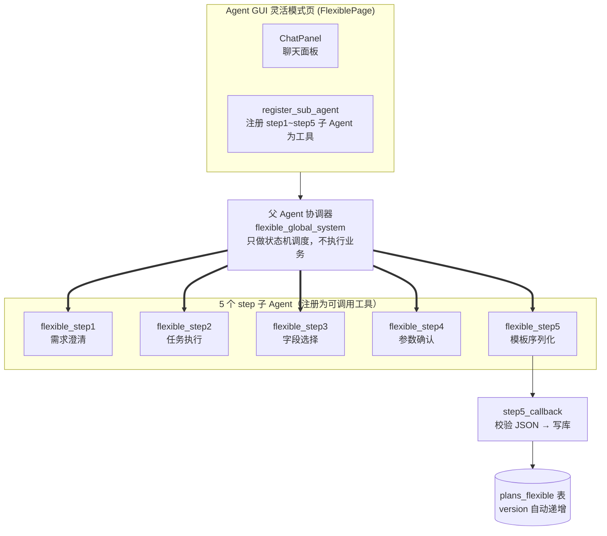
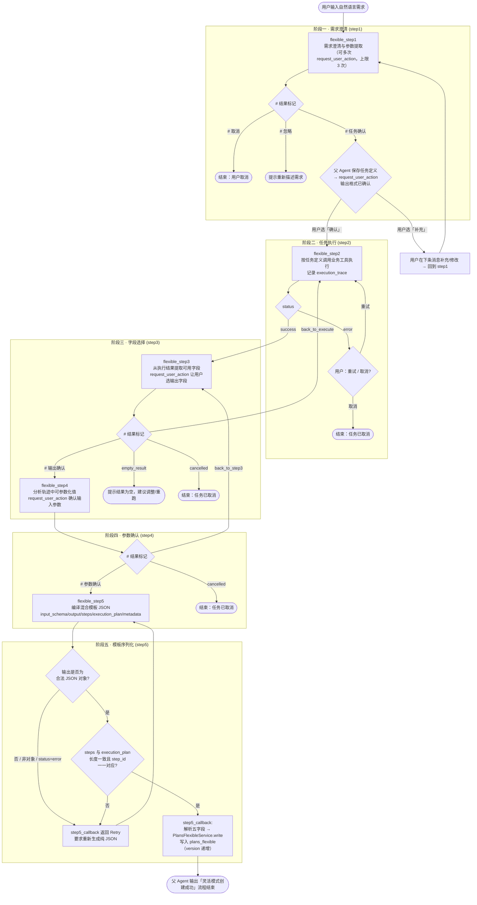
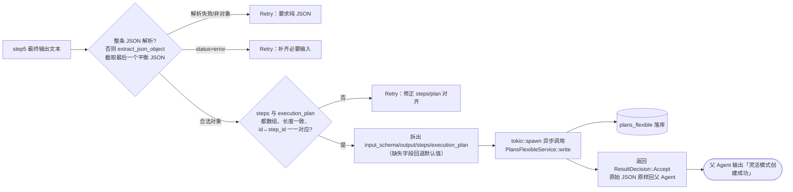

# 灵活模式（Flexible）流程分析

> 目标：把用户的一句话自然语言需求，经过 **5 个 step 子 Agent** 的接力处理，最终编译为一条**可执行的混合模板**（`steps` 硬脚本 + `execution_plan` 智能说明书）并**落库到 `plans_flexible` 表**。
>
> 对应源码目录：`crates/agent-gui/src/pages/plan/flexible/`
> 对应 Prompt：`crates/agent-gui/prompts/flexible/*.toml`

## 一、总体架构



- **父 Agent（协调器）**：`flexible/global_system` 定义整个状态机，自身「不进行需求澄清、不调用业务工具」，只负责按规则依次调用 5 个 step 子 Agent、做路由决策、并发起 `request_user_action` 用户交互。
- **子 Agent**：每个 step 被注册为一个 LLM 工具（`register_sub_agent`），父 Agent 以「调用工具」的方式驱动子 Agent 工作。注册入口在 `page.rs` 的 `use_hook` 内，卸载在 `use_drop` 内。
- **人机交互**：涉及用户决策的环节通过 `request_user_action`（结构化 UI 弹窗/选项）完成。
- **落库旁路**：`step5_callback`（`SubAgentResultCallback`）解析 step5 的输出 JSON 后写库，返回 `Accept`，原始 JSON 原样回传父 Agent 不影响展示。

## 二、阶段与文件对应

| 阶段 | 子 Agent / 动作 | 系统 Prompt | 页面注册（page.rs） | 回调 |
| --- | --- | --- | --- | --- |
| 需求澄清 | flexible_step1 | `flexible/flexible_step1` | L156–187 | 无 |
| 任务执行 | flexible_step2 | `flexible/flexible_step2` | L189–219 | `step2_callback.rs`（当前仅日志，Accept） |
| 字段选择 | flexible_step3 | `flexible/flexible_step3` | L221–252 | 无 |
| 参数确认 | flexible_step4 | `flexible/flexible_step4` | L254–289 | 无 |
| 模板序列化 | flexible_step5 | `flexible/flexible_step5` | L291–338 | `step5_callback.rs`（校验 + 落库） |

> `json_extract.rs` 定义 step2 的结构化载荷类型（`Step2Payload` / `TraceStep`）与从 Markdown 混合文本中提取 ` ```json ``` ` 的解析工具，供消费 step2 输出使用。

## 三、端到端流程图



## 四、各子 Agent 详解

### 1. flexible_step1 — 需求澄清（阶段一）
**输入**：`user_message`（本次输入）、`conversation_summary`（历史摘要，可空）
**工具**：仅 `request_user_action`
**规则要点**（`flexible_step1.toml`）：
- 一个会话 = 一个任务，所有消息都合并进同一任务上下文，最新输入优先。
- 判断三类结果：`# 取消` / `# 忽略` / `# 任务确认`。
- **输出格式是必须由用户明确确认的关键参数**，未指定时不得默认，必须追问（≤3 次交互）。
- 只追问影响任务定义的关键参数，不机械收集、不过度追问执行期细节。
- 需求充分后输出简洁 Markdown 任务定义（任务 + 参数 + 输出格式）。

**父 Agent 动作**：收到 `# 任务确认` 后不直接展示，先保存任务定义与输出格式，再发起 `request_user_action`（`confirm` 类型）让用户选择「补充 / 确认」。选「确认」才进入 step2。

### 2. flexible_step2 — 任务执行（阶段二）
**输入**：`task_definition`（来自 step1）、`runtime_context`（压缩上下文，首轮为空）
**工具**：全部业务工具（如 `browser_*` 等）
**输出**：结构化 JSON（对应 `json_extract.rs::Step2Payload`）——
```json
{ "status": "success|error", "execution_trace": [...], "compressed_context": "..." }
```
- `execution_trace`：按顺序记录的工具调用（tool / input / output_summary）
- `compressed_context`：压缩上下文，供后续执行复用
- `status=error` 时父 Agent 询问用户「重试 / 取消」，重试以相同任务定义再次调用 step2。
- 注册时挂了 `step2_callback`（`step2_callback.rs`），目前仅为日志通知（`ResultDecision::Accept`），`json_extract.rs` 是为将来解析消费预留。

### 3. flexible_step3 — 字段选择（阶段三）
**输入**：`execution_trace_summary`（step2 的 `compressed_context`）、`output_format`（step1 已确认）
**工具**：仅 `request_user_action`
**职责**：从执行结果数据中提取可用字段，让用户勾选最终输出的字段。
**结果标记路由**：`# 输出确认` → 进入 step4；`back_to_execute` → 重新回 step2 执行；`empty_result` → 提示结果为空；`cancelled` → 结束。

### 4. flexible_step4 — 参数确认（阶段四）
**输入**：`execution_trace`（step2 完整轨迹）、`output_format`（step1）、`field_selection_result`（step3 纯文本）
**工具**：仅 `request_user_action`
**职责**：分析执行轨迹中的具体参数值 → 识别**可参数化候选** → 与用户确认选中参数 → 生成最终**模板输入定义**。
**结果标记路由**：`# 参数确认` → 进入 step5；`back_to_step3` → 回 step3 重选字段；`cancelled` → 结束。

### 5. flexible_step5 — 模板序列化（阶段五）
**输入**：`task_definition`、`execution_trace`、`field_selection_result`、`parameter_confirmation_result`
**约束**：不调用任何工具，只输出 **纯 JSON**（无 Markdown 代码块/解释），五顶层字段：

```json
{
  "input_schema": { "month": { "type": "string", "required": true, "description": "...", "example": "..." } },
  "output": { "format": "Excel", "fields": ["order_id", "amount"] },
  "steps": [
    { "id": "step_1", "tool": "query_tool", "params": { "query": "..." } }
  ],
  "execution_plan": [
    { "step_id": "step_1", "intent": "...", "expected_schema": {...},
      "dynamic_hints": { "param_mapping": "...", "field_adaptation": "...", "fallback_tool": "...", "stable": false } }
  ],
  "metadata": { "created_at": "ISO 8601", "version": 1 }
}
```

- `input_schema`：基于 step4 选中参数（type/required/description/example）
- `output`：`format`(来自 step1) + `fields`(来自 step3 选中字段)
- `steps`：把 `execution_trace` 硬编码为脚本，步骤间引用用 `"{{previous_step_id.output}}"` 占位
- `execution_plan`：与 `steps` **1:1**，含意图 / 预期 schema / 动态修复提示（参数映射、字段适配、兜底工具、stable）
- 数据不完整时输出 `{ "status": "error", "message": "..." }`

## 五、落库与校验（step5_callback.rs）

step5 完成后触发 `FlexibleStep5Callback::on_result`，其工作流：



**校验分支全部返回 `Retry`**，携带纠正消息让子 Agent 重新生成（重试直到通过或交互中止）：

| 校验 | 触发条件 | Retry 提示 |
| --- | --- | --- |
| JSON 解析失败 | 非合法 JSON | 输出纯 JSON，去掉 ` ```json ` 标记与解释文本 |
| 非 JSON 对象 | 解析成标量/数组 | 输出含五顶层字段的对象 |
| status=error | 输出缺必要输入 | 基于四份输入补齐后重新生成 |
| steps/plan 结构 | 非数组或缺失 | 保证 `steps`、`execution_plan` 数组存在 |
| steps/plan 不对齐 | 长度不同或 `steps[i].id` ≠ `execution_plan[i].step_id` | 长度相同且 step_id 一一对应 |

**写库**：`PlansFlexibleService::write(plan_id, input_schema, output, steps, execution_plan)` → `PlansFlexibleRepo::create` 插入一行 `plans_flexible`，`version` 由仓库按「该 plan 最新版本 +1」自动递增（首条为 1）；`metadata.created_at` 拆为 `created_at` 列存储。

## 六、数据落库结构

`plans_flexible`（`storage/entities/plans_flexible.rs`）—— 每个 plan 的多版本快照表：

| 字段 | 说明 | 来源（step5 输出） |
| --- | --- | --- |
| id | UUID 主键 | 自动 |
| plan_id | FK → plans.id | 外部传入（页面 plan_id） |
| version | 1,2,3… 自动递增 | `metadata.version`（入库时重算） |
| input_schema | 输入参数定义 JSON | `input_schema` |
| output | 输出定义（format+fields） | `output` |
| steps | 硬脚本 JSON 数组 | `steps` |
| execution_plan | 智能说明书 JSON 数组 | `execution_plan` |
| created_at | 创建时间 | `metadata.created_at` |

## 七、核心设计要点小结

1. **纯协调器的父 Agent**：不执行业务、只驱动 5 个子 Agent 并按结果标记推进状态机。
2. **子 Agent = 工具**：每个 step 注册为父 Agent 可调用工具，天然形成「协调器 → 子 Agent」的分层结构（嵌套深度 depth=1 / max_depth=2）。
3. **人机闭环**：澄清（step1）、执行失败重试（step2）、字段选择（step3）、参数确认（step4）都通过 `request_user_action` 结构化交互征求用户意见。
4. **回调旁路落库**：step5 采用 `SubAgentResultCallback`，以 `Retry` 做硬校验兜底、`Accept` 原样透传，写库为异步旁路，不影响 GUI 展示。
5. **模板形态 = 混合**：`steps` 供零推理快速执行，`execution_plan` 提供按步的动态修复/容错说明书，两者 1:1 对齐。
6. **多版本**：每次成功重新模板化都会在 `plans_flexible` 追加新版本，历史快照可回溯。

## 八、边界与回退路径一览

| 路径 | 处理 |
| --- | --- |
| step1 `# 取消` / `# 忽略` | 结束流程 / 提示用户重新描述 |
| step1 输出格式未指定 | 必须 request_user_action 追问（≤3 次），不可默认 |
| step2 `status=error` | 用户选择重试（同定义重跑）或取消 |
| step3 `back_to_execute` | 回 step2 重新执行 |
| step3 `empty_result` | 告知结果为空，建议调整 |
| step3/4 `cancelled` | 结束流程 |
| step4 `back_to_step3` | 回 step3 重选字段 |
| step5 JSON/结构不合法 | step5_callback `Retry` 引导修正后重生成 |
| 写库失败 | 记 error 日志（回调不阻塞展示） |
