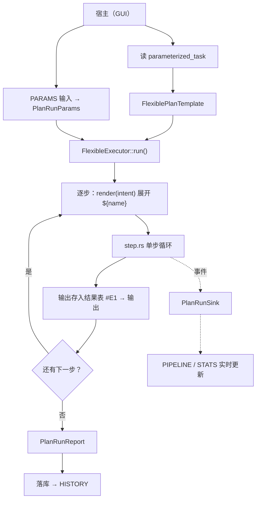

# Flexible Executor —— 灵活计划执行器

> 状态：🚧 内核已实现（阶段 0–4 完成，30 个单测全绿）；阶段 5 宿主接线、阶段 6 落库待做
>
> 最后更新：2026-09-23

---

## 1. 组件定位

把**已落库的灵活计划模板**跑起来。

灵活模式的生成链路（`flexible_clarify` → `flexible_plan` → `flexible_parameterize` → `flexible_save`）已经完备，产物是一个 `{ task, inputs, steps }` 的 JSON，存在 `plans_flexible_sessions.parameterized_task` 列里。**但从没有人执行过它**——本组件补上这一段。

一句话：**输入「模板 + 参数值」，输出「每步的执行结果 + 耗时 / token / 工具次数」，执行过程通过事件流实时播报。**

### 边界

| | 说明 |
|---|---|
| 归属 | `crates/planned-agent/src/flexible/`（新模块） |
| **不依赖** | `agent-gui`（无 Dioxus / 无 `Signal` / 无 `sea-orm`） |
| **不依赖** | `planner/`（`StepStore` / `DefaultReActAgent` / `PlanAndExecuteAgent` 一律不用） |
| 只依赖 | `planned-agent-core`（`AiClient`）+ `planned-agent-tool-manager`（`ToolRegistry`） |
| 不碰数据库 | 模板由调用方传入，报告返回给调用方；存不存、怎么存是宿主的事 |

宿主（GUI）只是它的一个消费者：读模板 → 收参数 → `run()` → 事件转信号 / 报告落库。

---

## 2. 背景与现状

### 2.1 已经具备的

| 环节 | 现状 | 位置 |
|---|---|---|
| 模板产出 | 4 个子 agent 定稿并落库 | `agent-gui/src/pages/plan/flexible/page.rs:131-298` |
| 模板落库 | 组装 `{task, inputs, steps}` 写入 `parameterized_task` | `flexible/step_callback/save/save_callback.rs:58-100` |
| 占位符契约 | `collect_placeholders` / `validate` / **`render`** 已实现 | `flexible/placeholder.rs:23-122` |
| 计划存储 | `plans_flexible_sessions`（会话即版本） | `agent-gui/src/storage/entities/plans_flexible_sessions.rs` |

### 2.2 缺口

| 环节 | 现状 | 依据 |
|---|---|---|
| **执行器** | 不存在 | `prompts/planning/flexible_execute_system.toml` 是**无人引用的孤儿 prompt**，语义正是"按参考计划灵活执行" |
| **模板模型** | 裸 `serde_json::Value`，无强类型 | 全仓无 `PlanTemplate` / `PlanInput` / `PlanStep` 类型 |
| **占位符替换** | `render()` 是 `#[allow(dead_code)]` | `placeholder.rs:102-103` 注释原文："执行器尚未实现，故暂时没有生产调用点" |
| **进度数据源** | 不存在 | `left_panel/pipeline.rs:5` 注释提到的 `WorkflowState` 全仓无实现，四块 UI 全是硬编码 mock |
| **token 采集** | 链路断 | `Usage` 类型就绪（`core/src/ai/types.rs:199`）、`ai-openai` 也填了（`client.rs:470`），但**上游零消费**——`grep` 全仓 `usage` 只有定义与测试里的 `None` |
| **耗时采集** | 不可用 | 现成的 `duration_ms` 全在 `planner/` 内（`Observation` / `ReActExecutionResult`），本模块不用 planner，只能自己掐表 |

**结论**：本模块要同时补上「模板强类型」「执行引擎」「进度事件」「指标采集」四件事。

---

## 3. 设计决策

### 3.1 为什么独立成模块，而不是放进 GUI

执行器是一台引擎，`agent-gui` 只是它的一个宿主。放 GUI 里会导致：

- 模板契约（`${name}` 的校验与替换）被迫留在 GUI，而执行器又必须用它 → 反向依赖；
- 引擎无法被 GUI 以外的宿主复用（CLI / 定时调度 / 将来的服务端）。

因此落点选在 `planned-agent`（GUI 本来就依赖它），依赖方向强制单向：`agent-gui → planned-agent::flexible → core / tool-manager`。

### 3.2 为什么不复用 `planner/`

- `planner/` 是「粗粒度计划生成 → 逐步执行」的一整条流水线，`PlanAndExecuteAgent::execute()` 内部会**重新生成**计划（`plan_execute_agent.rs:132-139`），而我们要执行的是**已落库的模板**；
- 复用需要给它开"传入既有计划"的口子，且它走 `CoarseGrainedPlan` 转换会丢失模板的 `${name}` / `expected_output` 原样语义；
- 更重要的：`planner/` 与本模块职责重叠但契约不同（粗粒度计划 vs 参数化模板），混在一起会让两套契约互相污染。

### 3.3 为什么不复用 `chat/SubAgentRunner`

`SubAgentRunner` + `ChatService` 也能跑循环，但有两笔账：

1. **token 拿不到。** LLM 调用发生在 `ChatService` 的内部 driver 里，`chunk.usage` 在 `chat/driver/round/stream.rs` 的 `process_stream_chunk` 就被丢弃了。要拿到就必须改 driver——那正是要避免的"侵入共享链路"。
2. **能力用不上。** `ChatService` 是为聊天设计的：用户确认挂起 / 恢复、history 持久化、多会话隔离、事件桥。执行一个计划不需要其中任何一项。

### 3.4 每步一个自建的 ReAct 循环

`step.rs` 自己写一个小循环（LLM → 要调工具就调 → 结果回灌 → 再问 LLM，直到它不再要工具）。LLM 调用就在自己手里，`ChatCompletionResponse.usage` 直接拿。

这是本模块**唯一**的"重造轮子"，代价在第 8 节说明。

---

## 4. 目录结构

```
crates/planned-agent/src/flexible/
├── mod.rs          门面：声明子模块 + 对外导出（外面只 use 这里）
├── template.rs     计划模板的强类型：task / inputs / steps，从落库 JSON 反序列化
├── placeholder.rs  ${name} 的收集 / 校验 / 替换（自 GUI 迁入）
├── params.rs       运行参数表：参数名 → 值（用户填的 > default）
├── prompt.rs       内置提示词常量（执行器自己的 system / step prompt）
├── step.rs         单步执行：工具循环 + 掐耗时 / 收 token
├── event.rs        进度事件 PlanRunEvent + PlanRunSink（对外的唯一进度通道）
├── report.rs       执行报告 PlanRunReport / StepRunRecord（汇总指标）
└── executor.rs     总编排：按顺序跑每步 + 传步骤结果 + 发事件 + 响应取消
```

挂载方式：`crates/planned-agent/src/lib.rs` 加一行 `pub mod flexible;`。

### 各文件职责

| 文件 | 职责 |
|---|---|
| `template.rs` | 把 `{task, inputs, steps}` 变成长着字段的 Rust 结构体，不再拿裸 JSON 到处摸 |
| `placeholder.rs` | 认 `${file_path}` 这类占位符：从 steps 里捞出来、校验是否都有定义、运行时换成真值 |
| `params.rs` | 一张运行参数表。用户没填取 template 的 `default`，填了就覆盖 |
| `prompt.rs` | 执行器要对 LLM 说的话，写成 Rust 常量。宿主无需加载额外 prompt 文件 |
| `step.rs` | 一步的执行过程（见 6.2），同时采集耗时与 token |
| `event.rs` | 往外播报："开始了""第 2 步开始""第 2 步在想…""第 2 步完成（3.1s / 1.2k tk）" |
| `report.rs` | 跑完后的总账：总耗时、总 token、工具调用次数、每步明细 |
| `executor.rs` | 总指挥：按顺序跑每步、把前序输出递给后面的步、播事件、响应取消 |

---

## 5. 核心类型

### 5.1 模板（`template.rs`）

```rust
#[derive(Debug, Clone, Serialize, Deserialize)]
pub struct FlexiblePlanTemplate {
    pub task: String,
    pub inputs: Vec<PlanInput>,
    pub steps: Vec<PlanStep>,
}

#[derive(Debug, Clone, Serialize, Deserialize)]
pub struct PlanInput {
    pub name: String,
    #[serde(default)]
    pub default: Option<Value>,
    #[serde(default)]
    pub description: Option<String>,
}

#[derive(Debug, Clone, Serialize, Deserialize)]
pub struct PlanStep {
    /// 结果引用标识，如 "#E1"（计划内唯一）
    pub result_reference: String,
    /// 子目标描述，可能含 ${name} 占位符
    pub intent: String,
    /// 可验证产出（"做到什么样算完成"）
    pub expected_output: String,
    /// 依赖的前序 result_reference
    #[serde(default)]
    pub dependencies: Vec<String>,
}
```

字段与 `save_callback.rs` 落库的 JSON 一一对应，`result_reference` / `dependencies` 沿用 `^#E\d+$` 约定。

### 5.2 参数与占位符（`params.rs` / `placeholder.rs`）

```rust
pub struct PlanRunParams {
    values: BTreeMap<String, Value>,
}

impl PlanRunParams {
    /// 用模板 inputs 的 default 初始化
    pub fn from_template(tpl: &FlexiblePlanTemplate) -> Self;
    pub fn set(&mut self, name: &str, value: Value);
    pub fn get(&self, name: &str) -> Option<&Value>;
}
```

`placeholder.rs` 从 GUI 原样迁入（`collect_placeholders` / `collect_from_steps` / `validate` / `render`），契约不变：

- 语法固定 `${name}`，`name` 必须与 `inputs[].name` 完全一致；
- 只扫描 `intent` / `expected_output` 两个字段；
- **不得自创占位符**——`steps` 里出现而 `inputs` 未定义的，一律报错，绝不静默留空；
- 未闭合的 `${` 也是错。

> 迁入后 GUI 侧的 `placeholder.rs` 退化为重导出或删除，`save_callback.rs:92` 的 `validate` 调用改为引用新路径。

### 5.3 事件（`event.rs`）

对外唯一的进度契约，纯 Rust 类型：

```rust
pub enum PlanRunEvent {
    RunStarted { total_steps: usize },
    StepStarted { index: usize, intent: String },
    /// 单轮思考文本（非逐字，见第 8 节）
    StepThought { index: usize, round: usize, text: String },
    StepToolCall { index: usize, tool: String, ok: bool },
    StepFinished { index: usize, record: StepRunRecord },
    RunFinished { report: PlanRunReport },
    Failed { index: Option<usize>, error: String },
}

pub trait PlanRunSink: Send + Sync {
    fn emit(&self, event: PlanRunEvent);
}
```

也可以提供 `mpsc::Sender<PlanRunEvent>` 的实现，二者择一即可。

### 5.4 报告（`report.rs`）

```rust
pub struct StepRunRecord {
    pub index: usize,
    pub result_reference: String,
    pub intent: String,            // 占位符已展开
    pub expected_output: String,
    pub status: StepStatus,        // Done / Failed / Skipped
    pub duration_ms: u64,
    /// 该步所有 LLM 轮次 token 之和（= call_usages 的 sum）
    pub prompt_tokens: u32,
    pub completion_tokens: u32,
    pub tool_calls: usize,
    pub rounds: usize,             // 该步的工具循环轮数
    /// 单次（每轮 LLM 请求）token 明细，见 8.1
    pub call_usages: Vec<CallUsage>,
    pub output_summary: Option<String>,
    pub error: Option<String>,
}

/// 一次 LLM 请求的 token 用量。
#[derive(Debug, Clone, Serialize, Deserialize)]
pub struct CallUsage {
    /// 该步内的轮次序号（从 1 开始）
    pub round: usize,
    pub prompt_tokens: u32,
    pub completion_tokens: u32,
}

pub struct PlanRunReport {
    pub success: bool,
    pub total_duration_ms: u64,
    pub prompt_tokens: u32,
    pub completion_tokens: u32,
    pub tool_calls: usize,
    pub steps: Vec<StepRunRecord>,
}
```

`PlanRunReport` 的字段直接对应 STATS 块要展示的 `Exec time` / `Tokens` / `Tools called` / `Steps done` / `Errors`。

### 5.5 执行器接口（`executor.rs`）

```rust
pub struct FlexibleExecutor {
    ai: Arc<dyn AiClient>,
    tools: Arc<ToolRegistry>,
    cfg: ExecutorConfig,
}

impl FlexibleExecutor {
    pub fn new(ai: Arc<dyn AiClient>, tools: Arc<ToolRegistry>, cfg: ExecutorConfig) -> Self;

    pub async fn run(
        &self,
        template: &FlexiblePlanTemplate,
        params: &PlanRunParams,
        sink: &dyn PlanRunSink,
        cancel: Option<watch::Receiver<bool>>,
    ) -> Result<PlanRunReport>;
}

pub struct ExecutorConfig {
    /// 每步工具循环的轮数上限
    pub max_rounds_per_step: usize,
    pub temperature: Option<f32>,
    pub max_tokens: Option<u32>,
    /// 工具白名单，语义与 `ChatConfig::allowed_tools` **完全一致**（见第 7 节）：
    /// `None` = 全部启用工具（含 Utility / SubAgent，不过滤）；
    /// `Some(tokens)` = 各 token 取并集（`"all"` / 分类名 / 精确工具名）。
    pub allowed_tools: Option<Vec<String>>,
}
```

注意：执行器只认 `Arc<dyn AiClient>`，不依赖 `ai-manager` crate——宿主自己用 `AiManager::default()` 取到再传进来。

---

## 6. 执行流程

### 6.1 总流程



### 6.2 单步内部（`step.rs`）

```
步骤描述 = 展开后的 intent + "期望产出：" + expected_output
         + 前序依赖（dependencies 里的 #En）的实际输出摘要

messages = [ system(prompt.rs), user(步骤描述) ]
loop {
    rounds += 1
    resp = ai.chat_completion(messages, tools)   // 非流式
    记一条 CallUsage(round = rounds) → 累加为本步 tokens
    emit StepThought(思考文本，非空时)

    if resp 无 tool_calls {
        本步输出 = resp 正文
        break
    }
    if rounds >= cfg.max_rounds_per_step { 本步失败 }   // 末轮仍要调工具 → 判失败

    messages.push(assistant(tool_calls))
    for call in tool_calls {
        outcome = tools.call_tool(call.name, call.arguments)
        emit StepToolCall(call.name, !outcome.result.is_error)
        messages.push(tool 消息)        // 结果回显（含 is_error）
    }
}
```

每一步都是"自包含"的：全新消息列表、全新循环，与前一步只通过结果表（`#En` → 输出）交换数据。

### 6.3 取消

`watch::Receiver<bool>`，在每次 LLM 调用前与每次工具调用前检查；收到取消则中止循环，把已完成的步骤照常写进 `PlanRunReport`（`success = false`），并发出 `Failed`。

---

## 7. 依赖的外部接口（均已存在）

| 用途 | 接口 | 位置 |
|---|---|---|
| 发 LLM 请求 | `AiClient::chat_completion` | `core/src/ai/traits.rs:9` |
| **token** | `ChatCompletionResponse.usage: Option<Usage>` | `core/src/ai/types.rs:168` |
| token 结构 | `Usage { prompt_tokens, completion_tokens, total_tokens }` | `core/src/ai/types.rs:199-203` |
| 工具定义 | `ToolDefinition` / `FunctionDefinition` | `core/src/ai/types.rs:118-132` |
| 工具清单 | `ToolRegistry::get_enabled_tools_with_categories()` | `tool-manager/src/core/registry.rs`（chat 同款） |
| 白名单过滤 | `select_tools_by_tokens()` ← **复用** | `chat/tools/mod.rs:52-93` |
| 执行工具 | `ToolRegistry::call_tool()` | `tool-manager/src/core/registry.rs:598` |
| 工具结果 | `ToolOutcome { result: ToolResult, categories }` | `tool-manager/src/core/types.rs:19` |
| 工具结构 | `Tool { name, description, input_schema }` | `core/src/mcp/types.rs:6-10` |

本模块几乎不修改上述任何一处，唯一例外是**放宽 `select_tools_by_tokens` 的可见性**（`pub(super)` → `pub(crate)`，连同 `chat/mod.rs` 的 `mod tools`），以便复用同一套白名单规则、避免两处规则漂移。纯可见性调整，不改行为。

---

## 8. 已知取舍

| 取舍 | 说明 |
|---|---|
| **THINK 终端非流式（已定：不接流式）** | LLM 走非流式调用，`StepThought` 是"一轮一跳"地追加，不是逐字吐。改流式的真实成本：① 必须在 `ai-openai/src/client.rs` 的 `convert_request` 补 `stream_options: {"include_usage": true}`，否则流式**完全拿不到 usage**（全仓无此配置，标准 OpenAI 流式默认不发 usage chunk，`client.rs:541` 那段映射实际恒为 `None`）；② 要在 `step.rs` 自行处理 `DeltaToolCall` 的 arguments 分片累加。收益（THINK 逐字）在执行场景价值低，故不做；`StepThought` 按"块"发，将来改逐字不改对外契约 |
| **自己写循环的成本** | 需自行处理 tool_calls 拼装、轮数上限、工具报错、消息顺序，比复用 `ChatService` 多写几百行。换来 token / 耗时 / 事件全自主，且与 `chat`、`planner` 零耦合 |
| **`expected_output` 只作提示** | 目前把 `expected_output` 作为"完成标准"写进提示词，由 LLM 自行判断收敛，不做确定性校验 |
| **不做用户交互** | 不支持 `request_user_action` 式的挂起 / 恢复。计划执行假定不需要人工介入 |

### 8.1 token 的两种粒度

一个步骤内部是「LLM ⇄ 工具」的循环，**每轮都发一次 LLM 请求**（`messages` 整个重发）。因此有两级统计：

| 粒度 | 含义 | 归属 | 用途 |
|---|---|---|---|
| 步骤级 | 该步所有轮次之和 | `StepRunRecord.prompt_tokens` / `completion_tokens` | UI（STATS / HISTORY）、落库 |
| 单次级 | 每轮一条 | `StepRunRecord.call_usages` | 诊断：钱花在哪一轮 |

**必须知道的坑**：循环每轮把整个上下文重发一遍，所以第 N 轮的 `prompt_tokens` 含前 N-1 轮的全部内容（含工具返回的大段文本）。**步骤级总和会显著大于「该步的上下文大小」**——这是 API 计费的真实语义，不是重复计算错误。

保留单次级的意义：某轮工具返回 5 万字文档导致上下文膨胀时，只有单次级能看见这个跳变；步骤级会把它平均掉。成本极低（循环里顺手 push），丢了以后要诊断就得重跑。

---

## 9. 接入方约定（宿主需要做的）

宿主不在本模块内，但接口依赖以下几点：

1. **取 AI 客户端**：`AiManager::default()?` → `Arc<dyn AiClient>`；
2. **读模板**：`plans_flexible_sessions.parameterized_task` → `serde_json::from_str::<FlexiblePlanTemplate>()`；
3. **收参数**：PARAMS 块的编辑值 → `PlanRunParams`；
4. **跑**：`tokio::spawn(executor.run(tpl, params, sink, cancel))`；
5. **事件 → UI**：`PlanRunEvent` 映射成 Dioxus 信号，驱动 `PipelineView` / `StatsView`；`StepThought` 喂 THINK 终端；`StepFinished.duration_ms` 喂每步 meta；
6. **报告 → 历史**：`PlanRunReport` 返回给宿主，落库形态待定（见第 11 节），最终驱动 `HistoryView`。

对应 UI 现状：

- `left_panel/pipeline.rs` 目前是硬编码的 S1–S4 mock，需接 `PlanRunEvent`；
- `left_panel/params.rs` 目前 input 是 `readonly`，需改成可编辑并产出 `PlanRunParams`；
- `left_panel/stats.rs` / `history.rs` 同为 mock，分别接 `PlanRunReport` 与执行记录表。

---

## 10. 实现 TODO

> 进度：阶段 0–4 ✅ 完成（`flexible::` **30 passed / 0 failed**）；阶段 5–6 待做。
> 验证命令：`cargo test -p planned-agent --lib flexible::`。
> 全量 `cargo test -p planned-agent --lib` 有 3 个**既有**失败（`planner::coarse::llm_planner` 的 prompt root 漂移，与本模块无关）。

勾选式清单，按依赖顺序排列。每项的「验收」是判定完成的唯一标准。阶段 0–4 全在本模块内（阶段 0 是 `chat` 里的一处可见性调整），阶段 5 在宿主侧。

### 阶段 0 — 前置（在 `chat` 里）✅

> ✅ 已完成 —— `cargo test -p planned-agent --lib chat::tools::` → 5 passed（可见性调整未改行为）。

- [x] ✅ **0.1 放宽白名单过滤的可见性**
  - `chat/tools/mod.rs`：`select_tools_by_tokens` 由 `pub(super)` 改为 `pub(crate)`
  - `chat/mod.rs`：`mod tools` 改为 `pub(crate) mod tools`
  - 验收：`cargo build -p planned-agent` 通过；`chat` 既有测试全绿（纯可见性调整，不改行为）

### 阶段 1 — 模板与参数（纯函数，不依赖 AI / 工具）✅

> ✅ 已完成 —— template 4 + placeholder 7 + params 5 = **16 passed**。

- [x] ✅ **1.1 `flexible/template.rs`**
  - 定义 `FlexiblePlanTemplate` / `PlanInput` / `PlanStep`（`Serialize` + `Deserialize` + `Debug` + `Clone`）
  - 可选字段一律 `#[serde(default)]`：`PlanInput.default` / `description`、`PlanStep.dependencies`
  - 提供 `FlexiblePlanTemplate::from_json(&str) -> Result<Self>`（薄封装，失败时带上下文）
  - 验收：用真实落库样例（`{task, inputs, steps}`）反序列化成功；缺 `dependencies` 的步骤不报错
- [x] ✅ **1.2 `flexible/placeholder.rs`**
  - 从 `agent-gui/src/pages/plan/flexible/placeholder.rs` 迁入 4 个函数（`collect_placeholders` / `collect_from_steps` / `validate` / `render`），契约不变
  - 既有 7 个测试一并迁入
  - 验收：迁入的测试全绿
- [x] ✅ **1.3 `flexible/params.rs`**
  - `PlanRunParams`：`from_template`（用 `inputs[].default` 初始化）、`set` / `get`
  - 与 `placeholder::render` 对接：`render_step_intent(step, params) -> Result<String>`
  - 验收：未填参数取 `default`；缺值且无 `default` → 报错，不静默留空

### 阶段 2 — 事件与报告（纯数据）✅

> ✅ 已完成 —— 编译即验；report 2 个用例绿（累计 **18 passed**）。

- [x] ✅ **2.1 `flexible/event.rs`**：`PlanRunEvent` 枚举 + `PlanRunSink` trait + `mpsc::Sender` 实现
- [x] ✅ **2.2 `flexible/report.rs`**：`StepRunRecord` / `CallUsage` / `PlanRunReport` / `StepStatus`
  - 验收：`cargo build` 通过（纯数据类型，编译即验）

### 阶段 3 — 单步执行 ✅

> ✅ 已完成 —— prompt 2 + step 6 = 8 个用例，含 6 个必覆盖项（累计 **26 passed**）。

- [x] ✅ **3.1 `flexible/prompt.rs`**：system prompt 常量 + 单步任务文本的拼装函数
- [x] ✅ **3.2 测试桩 `FakeAiClient`**（`#[cfg(test)]`）：按脚本返回预设响应（含 `tool_calls`）
  - 验收：能驱动「无工具直接收敛」与「两轮工具调用」两种脚本
- [x] ✅ **3.3 `flexible/step.rs`**：`run_step()` —— 工具循环 + 耗时 + token
  - 覆盖用例：① 无 `tool_calls` 直接收敛；② 一轮工具调用后收敛；③ 超 `max_rounds_per_step` 判定失败；④ 工具 `is_error` 结果仍回灌；⑤ `call_usages.len() == rounds`；⑥ 步骤级 token 等于各轮之和
  - 验收：上述 6 个用例全绿

### 阶段 4 — 总编排与挂载 ✅

> ✅ 已完成 —— executor 4 个用例；flexible 累计 **30 passed**；`cargo check -p planned-agent-gui` 通过（下游未破）。
>
> 实现期修正：`run()` 原用可变 `success` 标志，「一上来就取消」时不会被置 false → 误报 `success = true`；已改为「非空且每步都 Done」的结构化判定。

- [x] ✅ **4.1 `flexible/executor.rs`**：`FlexibleExecutor::run()`
  - 逐步：render 展开 → `run_step` → 结果表写入（`#En` → 输出）→ 发事件
  - 取消：每轮 LLM 调用前与每次工具调用前检查 `watch`
  - 验收：两步模板（第二步 `dependencies: ["#E1"]`）能收到第一步的输出；取消后 `success = false` 且保留已完成步骤
- [x] ✅ **4.2 `flexible/mod.rs` + `lib.rs`**：`pub mod flexible;` 与对外导出
  - 验收：crate 外可用 `use planned_agent::flexible::FlexibleExecutor;`

### 阶段 5 — 宿主接线（`agent-gui`，本模块之外）✅

> ✅ 已完成，但**形态已升级为「执行服务」**：宿主不再直接 `spawn(executor.run(...))`，
> 而是通过 `flexible::run_service` 的常驻服务执行、并按会话订阅进度。
> 设计的唯一出处：[`flexible-run-service.md`](./flexible-run-service.md)。
>
> 依赖方向不变：GUI → `flexible`，接线只发生在 GUI 侧；不要为了省事把 GUI 类型（`Signal` / `sea-orm`）带进 `flexible/`。

- [x] ✅ **5.1–5.5**：参数编辑、执行 / 停止按钮、事件 → UI（`PipelineView` / `StatsView`）
  全部由 `crates/agent-gui/src/services/run_service.rs` 与 `pages/plan/left_panel/` 承接；
  与执行器的交互收口在服务内核（`ServiceSink` 回送 `PlanRunEvent` → 快照 → 订阅推送）。

### 阶段 6 — 执行记录（延后，待表结构定案）

- [ ] **6.1** `PlanRunReport` 落库 → `HistoryView`（表结构与时机见第 11 节，暂不实现）

---

## 11. 决策记录

| # | 事项 | 结论 |
|---|---|---|
| 1 | 执行记录表结构 | **延后**。后续还会有其它不确定需求，先不定表结构；`PlanRunReport` 先只返回给宿主，落库时机与形态待定 |
| 2 | token 归属粒度 | **两级都留**：步骤级为主（UI + 落库），单次级为明细（诊断）。区别见 8.1 |
| 3 | 是否接入流式 | **不接**。理由见第 8 节；`StepThought` 按"块"发，预留将来改逐字的余地 |
| 4 | 工具白名单 | **对齐 `ChatConfig::allowed_tools`**，直接复用 `select_tools_by_tokens`，不做第二套规则 |
