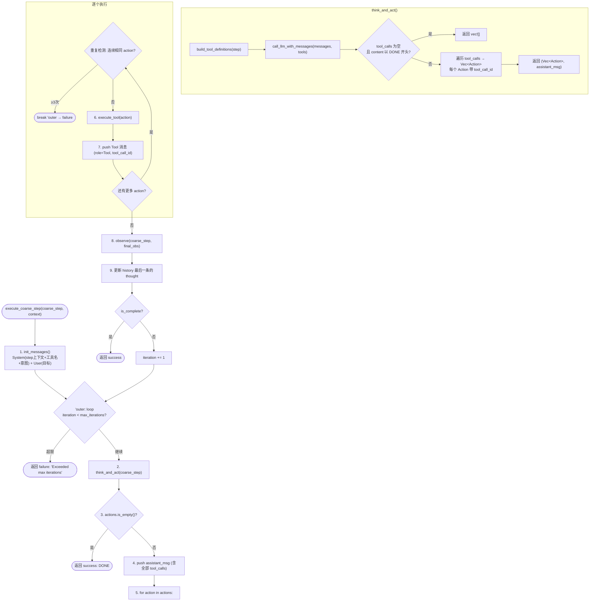

# ReAct 执行组件

## 1. 组件定位

ReAct 组件负责执行粗粒度计划中的单个步骤。它把一个步骤目标交给模型，通过“思考、行动、执行、观察”的循环动态选择工具，并根据工具结果判断该步骤是否完成。

当前实现位于 `planned-agent` crate，通用接口和类型位于 `core` crate：

- 实现：[DefaultReActAgent](../../crates/planned-agent/src/planner/react/default_react_agent.rs)
- 模块入口：[react/mod.rs](../../crates/planned-agent/src/planner/react/mod.rs)
- 抽象接口：[ReActAgent](../../crates/core/src/planner/react/react_trait.rs)
- 数据类型：[react_types.rs](../../crates/core/src/planner/react/react_types.rs)
- 思考提示词：[react_think.toml](../../prompts/planning/react_think.toml)
- 行动提示词：[react_act.toml](../../prompts/planning/react_act.toml)
- 观察提示词：[react_observe.toml](../../prompts/planning/react_observe.toml)

ReAct Agent 以粗粒度步骤为执行边界，不负责生成整个计划，也不负责跨步骤的重规划。

## 2. 组件边界

### 2.1 负责的工作

1. 分析当前粗粒度步骤、前序输出和执行历史。
2. 从工具注册表中读取工具描述。
3. 通过模型选择工具并生成参数。
4. 执行内置工具、MCP 工具或 `ai_process`。
5. 分析工具结果并判断当前步骤是否完成。
6. 保存每轮的思考、行动和观察记录。
7. 在达到完成条件、执行失败或超过迭代上限时返回结果。

### 2.2 不负责的工作

- 不生成粗粒度计划。
- 不改变粗粒度计划的步骤顺序。
- 不负责多个粗粒度步骤之间的调度。
- 不直接管理 AI 提供商或 MCP 连接生命周期。
- 不将工具定义直接传给模型的原生 `tools` 字段；当前实现将工具描述写入 Prompt 文本。

## 3. 依赖关系

`DefaultReActAgent` 组合以下依赖：

| 依赖 | 用途 |
| --- | --- |
| `AiClient` | 调用思考、行动、观察以及 `ai_process` 所需的模型请求 |
| `PromptManager` | 渲染三个 ReAct Prompt 并解析结构化响应 |
| `ToolRegistry` | 获取工具描述并路由实际工具调用 |
| `CoarseGrainedStep` | 提供当前步骤的目标和顺序信息 |
| `PlanContext` | 传递前序输出和后续步骤摘要 |

## 4. 核心数据类型

### 4.1 `Thought`

思考阶段的模型输出：

- `reasoning`：当前状态分析和推理过程。
- `plan`：下一步计划。
- `confidence`：`0.0` 到 `1.0` 的置信度。

### 4.2 `Action`

行动阶段的模型输出：

- `tool_name`：要调用的工具名称。
- `parameters`：工具参数，类型为 JSON `Value`。
- `reasoning`：选择该工具的理由（当前 `think_and_act` 合并模式下 LLM 不返回此字段，仅作历史记录可选）。
- `tool_call_id`：对应的 OpenAI tool_call ID，用于构造 Tool 响应消息。多 tool_call 场景下每个 Action 都携带独立的 ID。

### 4.3 `Observation`

工具执行后形成的观察：

- `output`：工具输出。
- `is_complete`：工具层面的完成标记；普通工具执行后默认是 `false`，最终完成由观察阶段判断。
- `error`：工具错误信息。
- `duration_ms`：本轮工具执行耗时。

### 4.4 `ReActStep`

一轮完整循环的历史记录，由 `Thought`、`Action` 和 `Observation` 组成。

### 4.5 `ReActExecutionResult`

最终返回值包含：

- `step_id`：当前粗粒度步骤 ID。
- `success`：该步骤是否成功完成。
- `output`：最终工具输出。
- `error`：失败原因。
- `history`：完整执行历史。
- `iterations`：使用的循环次数。
- `total_duration_ms`：总耗时。

## 5. 单步执行流程

`execute_coarse_step` 采用 **Think+Act 合并 → 多 Action 顺序执行 → 单次 Observe** 的架构：

- LLM 通过 OpenAI 原生 `tool_calls` 机制一次调用即可返回 0~N 个工具调用
- 多个 tool_call 全部顺序执行，每个都构造正确的 Tool 响应消息
- 所有 action 完成后，仅调用一次 `observe` 判断步骤是否完成



### 5.1 初始化（init_messages）

构建初始消息列表：

- `System`：动态渲染 `planning/react_system` Prompt，注入步骤意图、可用工具名称、前序结果摘要、后续步骤摘要、意图标志
- `User`：用户原始目标

前序结果以摘要形式注入（仅显示引用标识和大小），避免 System prompt 膨胀。

### 5.2 Think+Act 合并（think_and_act）

一次 LLM 调用完成思考和行动决策，不再分离 Think/Act 两个 Prompt：

1. 调用 `build_tool_definitions(step)` 构建工具定义（按 categories 解析 + 有依赖时自动添加 `fetch_step_result`）
2. 调用 `call_llm_with_messages(messages, tools)` 发送完整对话历史 + 工具定义
3. LLM 返回 Assistant Message，可包含 0~N 个 `tool_calls` 或文本 "DONE"
4. 解析 tool_calls → 构建 `Vec<Action>`，每个 Action 携带对应的 `tool_call_id`

**DONE 判断**：当 tool_calls 为空且 content 以 "DONE" 开头时，认为 LLM 判断步骤已完成。

**多 tool_call 处理**：LLM 返回多个 tool_call 时，全部提取为 Action，后续顺序执行。

### 5.3 工具执行（execute_tool）

工具执行按工具名分流：

#### `builtin_fetch_step_result`

直接从共享 `StepResultStore` 查找引用数据（如 `#E1`）：
- ≤800 字节：返回完整数据
- >800 字节：返回引用包装（含 size 和 hint，提示 LLM 后续直接传引用字符串）

#### 其他工具

1. **expand_refs**：递归扫描参数中的 `#E1` 引用字符串，自动从 Store 展开为真实数据
2. **ai_process**：特殊处理，展开引用后走独立 AI 子流程（不经过 ToolRegistry）
3. **普通工具**：通过 `tool_registry.call_tool` 执行
4. **后处理**：通过 `tool_result_router.process()` 一站式完成 StructureClean → HtmlClean → BinaryTruncate 链式处理

### 5.4 消息推入（每条 Action 后）

每执行完一个 Action，立即构造并推入一条 Tool 响应消息：

```
Message { role: Tool, tool_call_id: action.tool_call_id, content: ToolResult { ... } }
```

这保证了 OpenAI 消息交替约束：Assistant(tool_calls) → Tool(result) → Tool(result) → ... → 下一轮 Assistant。

### 5.5 观察（observe）

所有 action 执行完成后，仅调用一次 `observe`：

1. 取最后一条 observation 的 output 作为 tool_result
2. 用**独立 LLM 调用**（不走 messages 历史）渲染 `planning/react_observe` Prompt
3. 模型返回 `{is_complete, reasoning}`
4. observe 结论回流到 messages 历史（User prompt + Assistant response），供下轮 think_and_act 可见
5. 更新 history 最后一条记录的 `thought.reasoning` 和 `thought.confidence`

### 5.6 重复检测

记录每次 action 的签名（`tool_name:parameters`）：
- 连续 ≥3 次相同签名 → `break 'outer` 提前终止，防止死循环
- 签名变化时重置计数器

## 6. 上下文传递

主程序在逐步执行计划时为每个步骤注入 `PlanContext`，ReAct Agent 通过以下机制传递上下文：

| 机制 | 内容 |
| --- | --- |
| `StepResultStore`（共享 HashMap） | 前序步骤的执行结果，以引用标识（如 `#E1`）为 key。由 `fetch_step_result` 工具读取，由 `expand_refs` 自动展开 |
| `init_messages` System Prompt | 注入前序结果摘要（引用标识 + 大小）、后续步骤摘要、意图标志 |
| 对话历史 `self.messages` | 完整的 Assistant(tool_calls) → Tool(result) → observe(User+Assistant) 链路，LLM 每次调用都可见完整历史 |
| `CoarseGrainedStep.dependencies` | 声明式依赖，有依赖时自动为 LLM 注入 `fetch_step_result` 工具定义 |

后续步骤直接传 `"#E1"` 引用字符串作为工具参数，系统层自动展开为真实数据，LLM 无需感知引用展开细节。

## 7. Prompt 契约

### 7.1 `planning/react_system`

System Prompt，在 `init_messages` 时动态渲染，输入变量：

- `coarse_step`：当前步骤意图和期望输出
- `tool_names`：可用工具的名称、描述和输入 Schema（文本形式）
- `previous_results`：前序步骤结果摘要（引用标识 + 大小）
- `remaining_steps`：后续步骤摘要
- `data_requirements`：步骤的数据依赖声明
- 意图标志（`intent_flags`）：由 IntentRouter/IntentHandler 动态注入的提示变量

模型行为约束：
- 通过 OpenAI 原生 `tool_calls` 机制自主选择工具
- 无需调用工具时回复 "DONE"
- `fetch_step_result` 只调用一次获取前序结果；拿到引用标识后直接作为其他工具的参数值传入

### 7.2 `planning/react_observe`

观察 Prompt，在所有 action 执行完成后调用，输入变量：

- `coarse_step`：当前步骤意图和期望输出
- `tool_result`：最后一条 action 的工具输出
- 意图标志

输出字段：

- `is_complete`：布尔值，判断当前步骤是否完成
- `reasoning`：判断理由

`observe` 使用**独立 LLM 调用**（不走 messages 历史），避免 tool_calls 模式污染 LLM 输出格式。响应由 `PromptManager.parse_response` 解析。

## 8. 配置

`ReActAgentConfig` 定义以下配置项：

| 配置项 | 默认值 | 说明 |
| --- | ---: | --- |
| `max_iterations` | `10` | 单个粗粒度步骤允许的最大循环次数 |
| `step_timeout_ms` | `30000` | 单步总超时（毫秒），超时后步骤失败 |
| `max_retries` | `3` | `ai_process` 失败重试次数 |
| `retry_delay_ms` | `1000` | 重试延迟（预留字段，当前未使用） |

测试执行入口使用 `max_iterations = 5`，其他字段与默认配置一致。

## 9. 使用示例

```rust
let react_agent = DefaultReActAgent::new(
    ai_client,
    prompt_manager,
    tool_registry,
    ReActAgentConfig::default(),
);

let result = react_agent
    .execute_coarse_step(&coarse_step, &context)
    .await?;

if result.success {
    println!("最终输出: {}", result.output);
} else if let Some(error) = result.error {
    eprintln!("步骤执行失败: {}", error);
}
```

## 10. 错误处理和终止条件

### 10.1 思考失败

思考 Prompt 渲染、模型调用或响应解析失败时，当前步骤立即失败，不进入行动阶段。

### 10.2 行动失败

行动响应解析失败时最多重试三次。重试仍失败时，返回失败的 `ReActExecutionResult`。

### 10.3 工具失败

工具错误会被包装为观察结果。观察阶段会将其判定为未完成，执行循环可能继续尝试其他行动。

### 10.4 观察失败

观察 Prompt 渲染、模型调用或响应解析失败时，当前轮被记录为未完成；如果仍有迭代预算，则进入下一轮。

### 10.5 超过迭代上限

循环达到 `max_iterations` 仍未完成时，返回失败结果，错误信息包含最大迭代次数。

## 11. 执行历史

每一轮都会保存：

```text
第 N 轮
  思考：Thought.reasoning
  行动：Action.tool_name(Action.parameters)
  观察：Observation.output
```

历史既用于最终诊断，也会在下一轮 THINK 阶段重新提供给模型。最终结果只返回最后一次成功观察对应的工具输出，不会自动汇总所有轮次结果。

## 12. 已知问题与设计决策

### 待改进

- `retry_delay_ms`：预留字段，当前未在任何重试逻辑中使用。
- `max_retries`：仅在 `ai_process` 内部硬编码使用，未读取配置值。

### 设计决策（非 bug）

- `Observation.is_complete` 字段始终为 `false`：工具层面的完成标记不在此处判断，真正的完成由 `observe()` 返回的 `ObserveResult.is_complete` 决定。
- `ai_process` 返回 `is_complete=false`：`ai_process` 是数据处理步骤，完成后仍需 observe 判断整体步骤是否完成。
- 工具名称必须与 `ToolRegistry` 注册名一致：任何工具系统的固有约束。
- 多 tool_call 的 observe 只看最后一条 observation：前面的 action 结果已作为 Tool 消息进入对话历史，下轮 LLM 可见。

### 排查建议

排查时建议按以下顺序查看：

1. 检查日志 `[LLM] content=... tool_calls=...` 确认 LLM 返回了什么。
2. 检查 `Action.tool_name` 是否为已注册工具。
3. 检查 `Action.parameters` 是否符合工具输入 Schema。
4. 检查工具原始输出和 `Observation.error`。
5. 检查 `react_observe` 的 `is_complete` 判断及理由。
6. 检查执行历史，确认是否发生了重复调用或无效重试。

## 13. 测试建议

ReAct 组件适合使用 Mock `AiClient`、Mock `PromptManager` 和最小化 `ToolRegistry` 进行测试，至少覆盖：

- 一轮工具调用后完成。
- 工具返回错误后重试。
- 行动 JSON 解析失败后的重试。
- `ai_process` 处理 JSON 和纯文本输出。
- 前序输出和后续步骤摘要能够进入 Prompt。
- 达到最大迭代次数后返回失败。
