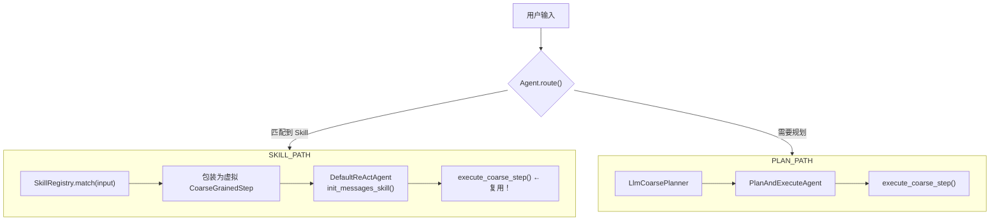

# Skill Execution 组件

> 状态：📋 待实现
>
> 最后更新：2026-07-30

## 1. 组件定位

当前 `DefaultReActAgent` 通过 `CoarseGrainedStep` 驱动，本质是"计划驱动"的 Agent——由 `CoarsePlanner` 先生成步骤，再逐步执行。

Skill Execution 组件允许用户定义**预制的、可复用的任务模板**（Skill），绕过计划生成阶段，直接用专用 System prompt + 受限工具集执行 ReAct 循环。

### 核心区别

| | Plan 步骤 | Skill 步骤 |
|---|---|---|
| 目标来源 | `CoarseGrainedPlan` 动态生成 | 预定义的 skill 模板 |
| System prompt | `react_system.toml` | `skills/xxx.toml`（每 skill 一个） |
| 工具集 | 按 `recommended_tool_categories` 筛选 | 按 skill 定义约束 |
| 完成判断 | `observe()` LLM 判断 | observe 判断，也可加确定性终止条件 |
| 步骤间数据传递 | `StepResultStore` + `fetch_step_result` | Skill 内部不需要跨步骤传递 |

## 2. 设计决策：复用 DefaultReActAgent

**不新建 Agent 类型**。`DefaultReActAgent` 已经提供了完整的执行能力：

| 能力 | 复用方式 |
|------|----------|
| ReAct 循环（think→act→observe） | 直接复用 `execute_coarse_step()` |
| 工具执行 + chunk 存储 | 直接复用 `execute_tool()` |
| 重复检测 / 超时 / 越界保护 | 直接复用循环守卫 |
| System prompt 注入 | 新增 `init_messages_skill()`，检测到 skill 模式时换 prompt |
| 迭代上限 | 每 skill 可独立配置 `max_iterations` |

**唯一新增的是初始化路径**：把 Skill 定义包装成一个虚拟的 `CoarseGrainedStep`，`init_messages` 检测到 skill 模式就注入 skill 专用 prompt。`ReActAgent` trait 完全不动。



## 3. 新增组件

### 3.1 `SkillRegistry`

存储所有已注册的 skill 定义，提供匹配和检索能力。

```rust
/// Skill 定义
struct SkillDefinition {
    /// skill 唯一标识
    name: String,
    /// 描述（用于匹配用户意图）
    description: String,
    /// 触发关键词（可选，用于快速匹配）
    keywords: Vec<String>,
    /// Tera 模板名，如 "skills/web_scraper.toml"
    prompt_template: String,
    /// 允许的工具类别（空 = 不限制）
    allowed_tools: Vec<ToolCategory>,
    /// 最大迭代次数（覆盖 ReActAgentConfig）
    max_iterations: Option<usize>,
    /// 输入参数的 JSON Schema
    input_schema: Value,
}

/// Skill 注册表
struct SkillRegistry {
    skills: HashMap<String, SkillDefinition>,
}

impl SkillRegistry {
    /// 根据用户输入匹配最合适的 skill，返回 (name, score)
    fn match_skill(&self, input: &str) -> Option<(&SkillDefinition, f32)>;

    /// 按名称精确查找
    fn get(&self, name: &str) -> Option<&SkillDefinition>;

    /// 注册 skill
    fn register(&mut self, skill: SkillDefinition);
}
```

匹配逻辑：
1. 关键词匹配（快速路径）→ 高置信度
2. 将用户输入 + 所有 skill 的 `description` 提交给 LLM 分类（慢路径）→ 中等置信度
3. 置信度低于阈值 → 回退到 Plan 路径

### 3.2 `DefaultReActAgent::new_for_skill()`

新增构造路径，把 skill 定义包装为执行单元：

```rust
impl DefaultReActAgent {
    /// 为 skill 执行创建 Agent
    pub fn new_for_skill(
        ai_client: Arc<dyn AiClient>,
        prompt_manager: Arc<PM>,
        tool_registry: Arc<ToolRegistry>,
        exec_ctx: Arc<ExecutorContext>,
        config: ReActAgentConfig,
        skill: &SkillDefinition,
    ) -> Self {
        // 1. 如果 skill 指定了 max_iterations，覆盖 config
        // 2. 创建 Agent（与 new() 相同）
        // 3. 标记为 skill 模式
    }

    /// Skill 模式的初始化（替代 init_messages）
    async fn init_messages_skill(
        &mut self,
        skill: &SkillDefinition,
        user_input: &str,
    ) -> Result<()> {
        // 渲染 skill 专用 System prompt
        let system_prompt = self.prompt_manager
            .render(&skill.prompt_template, &context)
            .await?;
        self.ctx.init_messages(system_prompt, user_input);
        Ok(())
    }

    /// 执行一个 skill（包装 execute_coarse_step）
    async fn execute_skill(
        &mut self,
        skill: &SkillDefinition,
        user_input: &str,
    ) -> Result<ReActExecutionResult> {
        self.init_messages_skill(skill, user_input).await?;

        // 将 skill 包装为虚拟 CoarseGrainedStep
        let virtual_step = CoarseGrainedStep::new(
            skill.name.clone(),
            0,
            skill.description.clone(),
            String::new(),
            String::new(),
        );
        // 注入工具类别约束
        if !skill.allowed_tools.is_empty() {
            virtual_step.recommended_tool_categories = Some(skill.allowed_tools.clone());
        }

        self.execute_coarse_step(&virtual_step, &PlanContext::default()).await
    }
}
```

### 3.3 入口路由：`Agent::route_and_execute()`

在 `agent.rs` 的 `Agent` 上新增路由方法：

```rust
impl Agent {
    /// 智能路由：Skill 优先，否则走 Plan-and-Execute
    pub async fn route_and_execute(&mut self, input: &str) -> Result<String> {
        // 1. Skill 匹配
        if let Some((skill, score)) = self.skill_registry.match_skill(input) {
            if score > SKILL_CONFIDENCE_THRESHOLD {
                info!("路由到 Skill: {} (score={})", skill.name, score);
                return self.execute_skill(skill, input).await;
            }
        }

        // 2. 回退：Plan-and-Execute
        info!("无匹配 Skill，走 Plan-and-Execute 路径");
        self.execute_plan(input).await
    }

    async fn execute_skill(&mut self, skill: &SkillDefinition, input: &str) -> Result<String> {
        let mut agent = DefaultReActAgent::new_for_skill(
            self.get_ai_client(None)?,
            self.prompt_manager_arc()?,
            self.tool_registry.clone(),
            self.exec_ctx.clone(),
            ReActAgentConfig::default(),
            skill,
        );
        let result = agent.execute_skill(skill, input).await?;
        Ok(serde_json::to_string(&result.output)?)
    }
}
```

## 4. Skill 定义示例

以 `web_scraper` skill 为例，使用 Tera 模板定义：

```toml
# prompts/skills/web_scraper.toml
[template]
name = "skills/web_scraper"

[system]
content = """
你是一个专业的网页抓取助手。你的任务是从给定的 URL 提取结构化信息。

## 工作流程
1. 使用浏览器工具导航到目标 URL（browser_navigate）
2. 等待页面加载完成（browser_wait_for）
3. 获取页面快照（browser_snapshot）
4. 如果快照内容不足，使用 browser_evaluate 提取具体元素
5. 将提取结果整理为结构化 JSON
6. 输出 DONE

## 约束
- 不要点击无关链接
- 不要在单个页面上停留超过 3 轮
- 提取结果必须包含：标题、主要内容、关键数据
- 使用 builtin_clean_html 工具清洗 HTML 后再提取文本
"""

[variables]
# 模板变量（由用户输入注入）
url = { type = "string", required = true, description = "目标网页 URL" }
extract_target = { type = "string", required = false, description = "要提取的具体信息描述" }
```

对应的 SkillDefinition：

```rust
SkillDefinition {
    name: "web_scraper".into(),
    description: "从网页提取结构化信息，包括标题、正文、关键数据".into(),
    keywords: vec!["抓取".into(), "爬虫".into(), "提取网页".into(), "scrape".into()],
    prompt_template: "skills/web_scraper".into(),
    allowed_tools: vec![ToolCategory::Browser, ToolCategory::Text],
    max_iterations: Some(10),
    input_schema: json!({...}),
}
```

## 5. Skill 加载方式

预定义 skill 放在 `prompts/skills/` 目录下，随 prompt_manager 一起加载：

```
prompts/
├── skills/
│   ├── web_scraper.toml
│   ├── code_review.toml
│   ├── data_analysis.toml
│   └── ...
├── planning/
│   └── ...
└── chat/
    └── ...
```

Agent 初始化时自动扫描 `prompts/skills/` 目录，注册所有 skill 定义到 `SkillRegistry`。

也支持运行时通过 `agent.register_skill(skill_def)` 动态注册。

## 6. 与 Plan-and-Execute 的关系

两者不是替代关系，而是**分工**：

| 场景 | 入口 |
|------|------|
| 用户说"帮我分析这个网页" → 模糊目标 | Plan-and-Execute（需要先生成步骤计划） |
| 用户说"抓取 https://xxx 的商品信息" → 匹配到 `web_scraper` | Skill 执行（直接走专用流程） |
| Skill 内部某个步骤需要子任务 | 可在 skill prompt 中指示 LLM 调用 `ai_process` |

Skill 本身也可以调用其他 skill（通过 tool 机制），形成可组合的能力单元。

## 7. 待讨论

- **Skill 间数据传递**：当前设计 skill 为独立执行单元，不考虑跨 skill 引用。如果后期需要 skill 编排（如 A skill 的输出作为 B skill 的输入），则需要引入类似 `StepResultStore` 的跨 skill 存储。
- **Skill 版本管理**：如果 skill prompt 频繁迭代，需要版本号机制避免破坏已有调用方。
- **Skill 的热加载**：是否需要支持不重启 Agent 就能注册/更新 skill。
